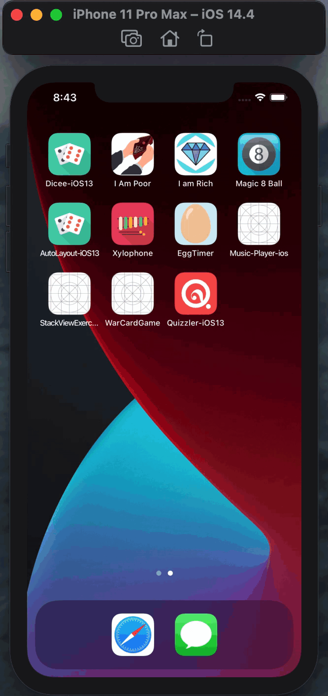

<h2>☑️ What is this app about?</h2>

A trivia quiz app. If you have another field of expertise such as law or medicine, you’ll be glad to know that multiple choice question apps are one of the most popular types of educational apps on the App Store! 

<h2>☑️ What have I learned?</h2>
<ul>
  <li>How to programmatically change UI elements such as Labels and Buttons.</li>
  <li>What is a design pattern and how is it used in programming.</li>
  <li>How to use the Model-View-Controller or MVC pattern for app development.</li>
  <li>Learned about Swift Structures how to instantiate a struct instance.</li>
  <li>Understand the difference between value types and reference types.</li>
  <li>Learned about Swift Classes and creating Objects.</li>
  <li>Comparing Swift Classes with Swift Structs and know when to use which.</li>
  <li>Learned about Object Oriented Programming.</li>
  <li>How to refactor code and stay organised.</li>
</ul>
<h2>☑️ Final look of Quizz app</h2>

